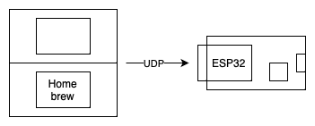
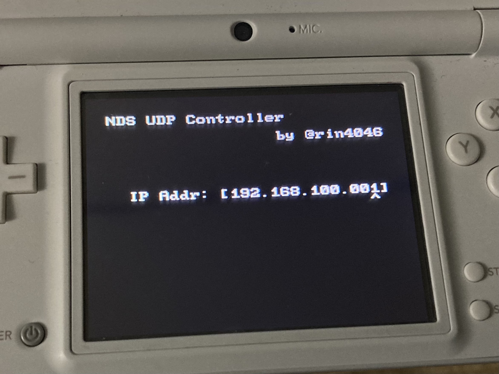
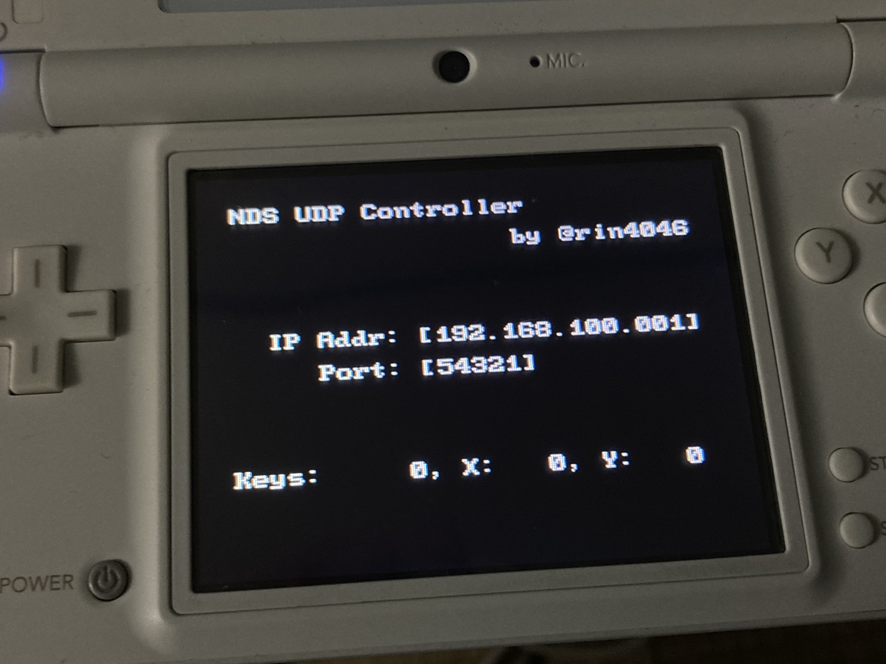

これは、

- [学ロボ Advent Calendar 2022](https://adventar.org/calendars/7461) 19日目
- [TUT Advent Calendar 2022](https://adventar.org/calendars/7400) 21日目

の記事です。昨日は、

- [電通大 pizacさんの記事「回路設計ミスまとめ」](https://pizac.hatenablog.com/entry/2022/12/18/115905)
- [おーうち先輩の記事「ふと一人旅に出てみた話」](https://note.com/giftpen/n/n2bec613f5566)

でした。来年あたりに僕も海外一人旅したい…

## ごあいさつ

はじめましての人ははじめまして、豊橋技術科学大学 B2の [@rin4046](https://twitter.com/rin4046) です。

技科大の方には、時間割アプリ "TUTility" とか、食堂メニュー見れるサイト作ってる人と言えばわかってもらえるのでしょうか。

ところで、私は現在B2であることからもわかるように、高専から編入したわけではなく神奈川県の普通科高校からやってきました。さらに、大学入学前まで一度たりともロボコンというものに興味を抱いたことがなく(観戦したことすらありませんでした、すみません)、豊橋技科大が学ロボに強いことも入学するまで全く知りませんでした。

そのためロボコン自体の経験もまだ2年と浅く、「大した内容は書けないなぁ、でもちょっと爪痕残しておきたいなぁ」みたいなことを考えていたのですが、その際にふと思いついたネタを実践してみました。

> 弊学の学生へ
> 
> このアドカレ記事はそれなりにロボコン要素がありますが、見た目のインパクトは大きいと思っているので、ロボコンに興味ない方にももしかしたら楽しんでもらえると思います。ぜひ最後まで読んでいただければ。

## ロボコンのコントローラーについて

みなさん、ロボットを操作する際、どのようなコントローラーを用いていますか？

定番どころで言えば、プレステのDS3、箱コン、最近なんかだとスマートフォンに挟んで使うタイプのコントローラーを使っている大学もありましたね(すっとぼけ)

つまるところ、ロボット自体に各大学個性があるように、それを操作するインターフェースもそれぞれ個性があるわけです。

ところで、私は今年の「とよはし ﾎｼ ロボコンズ」で昨年までやっていたことに加えてコントローラーの開発も担当することになったのですが、開発中の息抜きに作った駄作中の駄作、

「Nintendo DS as a Controller」

のあれこれを紹介します。

## システム構成

僕らが遊んできたDSの上で自作プログラム(Homebrew)を動かして、ESP32にボタン入力をUDPで送りつけるだけのシンプルな構成！

Wi-Fiアクセスポイント機能はESP32に頑張ってもらうので、DSとESP32さえあれば接続できます。

こんな構成でも明らかな遅延みたいなものは全く感じませんでした。

## 開発環境構築

### Nintendo DS側

DS内のCPUは、ロボコンでよく使われるSTM32と同じ32bit Armアーキテクチャなので、GNU Arm Toolchainで自作プログラムをビルドできます。

CubeIDE使わずに自力でToolchain揃えて開発してる猛者ならDSの開発環境構築も容易いとは思いますが、libndsというライブラリに依存しているし何より時間がもったいないので、[昨年のアドカレ](https://rinrin.me/posts/nds-dev-with-docker/) を参考にDockerコンテナを立ち上げるといいと思います。

### ESP32側

Arduino IDEを入れろ。

## 出来上がったもの

- Nintendo DS側: [https://github.com/rin4046/nds_udp_controller](https://github.com/rin4046/nds_udp_controller)
- ESP32側: [https://gist.github.com/rin4046/ca60e718536d148c7d2970a10cfd4bc3](https://gist.github.com/rin4046/ca60e718536d148c7d2970a10cfd4bc3)

特筆すべきは、[nds_udp_controller/include/udp_sender.hpp](https://github.com/rin4046/nds_udp_controller/blob/master/include/udp_sender.hpp) です。

インクルードしているヘッダだったり、呼び出してる関数が「LinuxとかWinsockのソレじゃないか！」と思った方もいるかと思います。こんな抽象化されたコードがDS上で動くのか、と。

[https://github.com/devkitPro/dswifi](https://github.com/devkitPro/dswifi)

このdswifiというライブラリ、DS上のWi-Fiを前提としたIPのプロトコルスタックが実装されてます(頭おかしい)。しかもこのライブラリ、 Linuxのソケット通信周りのAPIと互換性を持たせてあるため、既存コードの移植性がとても高いのです。これのおかげで、DS上でのUDPソケット通信が簡単に実現できました。ライブラリ作者様には頭が上がらないです。

ESP32の方は送られたUDPのパケットを読んで、ありきたりなコードでメカナムを動かしているだけなので特に面白くはないかと思います。なんかイキって複素数使って計算してますけど、そもそもDSの十字キー使うこと考えたら8方向 + 旋回に対応するdutyを予め定数で持っておけばいいんだよなぁ。

## 動画とか

そんなこんなで、完成したコントローラーを使う映像がこちらです。

ちょうどメカナム台車をお家で飼いたいなぁと思っていたので、適当なものをアマゾンでポチってみました。



## 写真とか

動画内で出てきたメカナム台車はこんな感じです。

DS側のUIもすこーしだけ凝ってみました。十字キーでIPアドレスとかポート番号の指定ができるようになってます。

## おわりに

もし、大会前までにコントローラーが出来上がらなかったら、「とよはし ﾎｼ ロボコンズ」はコレで学ロボに出場せざるを得なくなります()

そうならないようにコントローラー開発、頑張ります…
