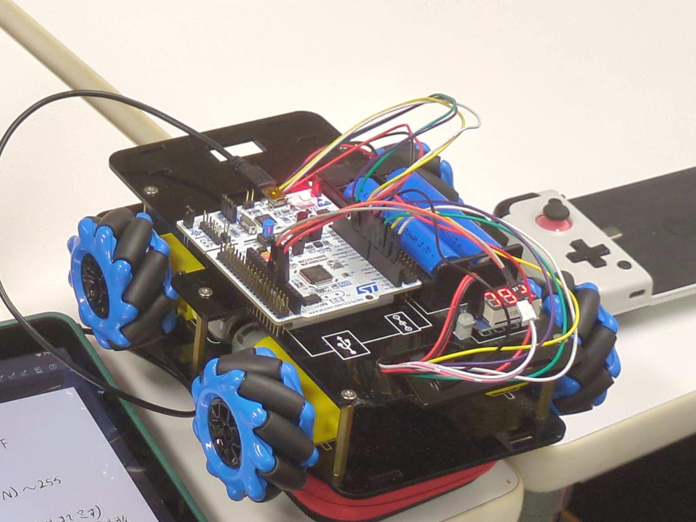

この記事は「[学ロボ Advent Calendar 2024](https://adventar.org/calendars/10297)」の5日目の記事になります(大遅刻しましたマジでごめんなさい)。

前回の記事は [@OneKrp](https://x.com/OneKrp) さんの「[ロボコンで役立ったおすすめ商品10選](https://note.com/onesugi/n/nd42fb5ef8d70)」です。現役時代にレセプション参加すればよかったなぁ…

# はじめに

お久しぶりです、豊橋技科大で22,23年の学生ロボコンに参加していた、現在B4の [@eyr1n](https://x.com/eyr1n) です。

少し前に国際会議で[ポスター発表](https://doi.org/10.1109/CLUSTERWorkshops61563.2024.00047)したり、最近は卒業研究に追われていたりとほんのり忙しいような、そうでもないような毎日を過ごしております。

引退してから１年くらい経っているのもあり、自分から何かロボットに関する発信はほとんどしていなかったように思いますが、ここ１年くらいはOBとして「とよはし☆ロボコンズ」に入部してくれたB1の学生にロボットの制御と回路についていろいろ教える活動をしていました。今回はその話をしようと思います。

# 弊部の新入生教育について

豊橋技科大には、ご存知の通り普通科や工業科などから入学する１年次入学の学生と、高等専門学校から編入する３年次入学の学生がいます。弊部においてもその２つのグループは混在しておりますが、高専編入者の人数が圧倒的です。大抵の場合、高専編入者はすでに高専ロボコン等で経験を積んでいますが、少数派である１年次入学の学生にそういった経験がある事例は珍しいため、何かしらロボコンに取り組む上での学びをサポートする環境が必要になります。

しかし、弊部にはこれまで形式化された教育環境が用意されておらず、自分で調べて、自分で実践して、都度わからないことがあれば先輩に聞く、をはじめのうちからできるようにしなければいけませんでした。このような環境のために部活を去る先輩や後輩を何人も見てきました。

このような状況が続くことは部にとって健全とは言い難いし、何よりこれからロボコンに挑戦する学生の志を折ることにつながるので何とかしたいなと思い、主体的に新入生講習を行うことにしました。

まだまだ完全に仕組みとして成り立つまでには至っていませんが、そのとっかかりにはなったのではないかと思っています。以下はその記録です。

## 5,6月 - 顔合わせ、プログラミング入門

はじめの頃は「[苦しんで覚えるC言語](https://9cguide.appspot.com/index.html)」というWebサイトをたどりながらC言語に慣れてもらいました。実際にプログラムを動かすにはC言語のコンパイラが必要になりますが、それを各々に用意させるのは酷だと思ったので、大学が用意しているHPCのログインノードにSSHしてもらい、そこでコンパイルと実行をしてもらいました。

また、C言語を学びながらSTM32を使った組み込み開発のさわりもやってもらいました。具体的にはLチカやLEDのPWM制御などをしてもらいました。

私も比較的大人数に教えるのが不慣れだったのもあり、かなりグダってしまった記憶。要改善。

## 7月 - STM32を使ったメカナムホイールの制御

これまでに教えたことを用いて、DCモータのPWM制御とメカナムホイール台車の全方位移動を試してもらいました。自分たちで調べて考えてやってもらったので力はつけてもらえたんじゃないかな。



8,9月は1年生の海外研修(なんかそういうのがあるらしい)とか夏休みとかであまり活動できませんでした。

## 10月 - C++入門、ロボットの配線、オムニホイールの制御

5,6月に行ったC言語入門の知識があまり定着していませんでした。これには、

- 単純に休みを跨いで時間が経ったこと
- あまりインタラクティブな教え方ではなかった
  - 章末問題的なものがあるが、あまりやっていて面白いと思えるものではなく、成長が実感しづらい

といったような原因があるように思います。そこで10月からは苦Cではなく「[C++入門 AtCoder Programming Guide for beginners](https://atcoder.jp/contests/APG4b)」を用いてプログラミングを学習してもらいました。

このサイトは、問題に従って作成したプログラムを提出すると、自動で正誤を判定してくれる仕組みがあるため、クイズ感覚で楽しくプログラミングを学習できます。苦Cよりもこれを使った方が明らかに１年生からのウケが良かったのではじめからこれを使えば良かったです。来年以降はそうした方がいいかも。

プログラミングの学習と並行して、ロボコンでよく使われる通信やそれらの配線の仕方についても教え、実際にM2006モータを用いたオムニホイール台車の配線をしてもらいました。

制御についても、PID制御やそれを用いたブラシレスモータの速度制御を学習してもらい、自由に動かしてもらいました。この辺りから各々のモチベが徐々に高まってきたのを感じます。

### 1年生のツイート

<blockquote class="twitter-tweet"><p lang="ja" dir="ltr">楽しすぎる<br>制御上手くいくとまじ嬉しい <a href="https://t.co/Oj2Oz9sdtm">pic.twitter.com/Oj2Oz9sdtm</a></p>&mdash; さとう (@tomomega33) <a href="https://twitter.com/tomomega33/status/1846589302131786022?ref_src=twsrc%5Etfw">October 16, 2024</a></blockquote> <script async src="https://platform.twitter.com/widgets.js" charset="utf-8"></script> 

## 11月 - 役割・やりたいことの細分化

ロボットの制御に入門してからだいぶ時間が経ったので、チームメンバーとしての各々のやるべきことややりたいことがだんだんと見えるようになってきたんじゃないかなと思います。たとえばROSなどを使ってロボットを動かす方法をどんどん学んでいきたい人もいれば、もっと低レイヤ(マイコンやその間の通信など)に興味を向ける人もいます。

そこで、制御・回路の中でも特に理論が関わってくる高レイヤの教育をM1の [@F1182502095](https://x.com/F1182502095) 先輩にお願いしました。実際にオドメトリの計算や簡単な経路追従を１年生に実践してもらい、かなり順調そうです。

私は今後、低レイヤと簡単な回路(STM32 Nucleoボードから各種通信ポートを生やすためのブリッジ基板製作程度)に関する教育を担当していこうかなと思っています。とはいっても、もうここまで来れば各々自走できるだけの力を身につけているはずなので、あとは少しだけ自分の知っている知識を押し付けて、さっと身を引くつもりです。

# 新入生教育用のSTM32向けライブラリを作った

ここからは、新入生教育の際に本質的な部分以外で躓くことができるだけないように、STM32とそのHALライブラリを使いやすくするために作ったライブラリ「tutrcos」の紹介をしていきます。

## tutrcos とは

このライブラリはRTOSをベースに、STM32固有の各種ペリフェラル(UART, SPI, CAN, ...)などを抽象化したライブラリです。さらにそれらを用いたIMUや無線通信モジュール、モータードライバなどと通信するためのクラス群が含まれています。

C++17以上がコンパイルできる環境で使うことができます。

ソースコードは以下で公開しています。

https://github.com/tutrobo/tutrcos

## なぜRTOSを使ったのか

先ほども述べたように、このライブラリは著名なオープンソースのRTOSであるFreeRTOSのArm社によるラッパー「CMSIS-RTOS2」をベースに実装しています。私が学生ロボコンに参加していた頃はRTOSを使用していませんでしたが、今回初めて導入を検討しました。

### RTOSの利点

RTOSを用いることで、何かタスクの完了を待っている間に他のタスクを割り込ませて並列に処理を行うことができます。今まではRTOSを使わずにタイマー割り込みを用いて並列処理をしていましたが、これには周期が固定であったり柔軟性に欠けるといった課題がありました。しかし、RTOSの導入によって並列処理を実現する機構を自分で実装する必要がなくなり、マルチタスクの管理がとても楽になりました。

ロボット制御においてマルチタスクが扱えるようになると、通信ループと制御ループを並列に動かすことができるようになります。たとえば制御ループを100Hzで動作させたい時に、それよりも遅い周期でデータを送信する基板から受信することを考えます。この時、HAL_UART_Receiveのような関数でブロッキング受信すると100Hzの制御ループを実現することができません。割り込みやDMA転送を用いてノンブロッキングで受信することも可能ですが、これらを用いる場合、受信完了を割り込み関数からメインループに伝えるためにグローバル変数にフラグを立てて結局それをポーリングしないといけなかったり、とそのまま扱うには少し不便です。

これを解決するために、RTOSに用意された同期プリミティブを用いることができます。RTOSは複数のタスクを扱う機能と、タスクと割り込み関数の両方から取り扱うことができるキューやセマフォを提供します。たとえば、UARTの受信割り込みがよばれた際、割り込み関数からキューにデータを転送します。メインのタスクではこのキューにデータが来るまで他のタスクに処理能力を譲ることができるため、効率的に受信を行うことができます。

### RTOSの欠点

RTOSにも欠点はあります。大抵の場合、1ms周期未満の粒度でタスク切り替えを行うことができません。よって、それ以上のきめ細かなタイミングを要するプログラムを実装するには不向きです。また、慣れないうちはプログラムのデバッグが困難になることも欠点の一つです(ライブラリを実装するにあたってコールスタックと睨めっこを繰り返しました…)。

とはいえ、少なくとも新入生教育にあたってはそこまでの周期を必要としないし(せいぜい10ms程度)、それ以上に安全なプログラムを組みやすくなる利点の方が多いので今回はRTOSを採用することにしました。

そのほかにも、STM32の開発でよく使われるArm社のmbedOSや、ESP32向けArduino CoreもRTOSがベースになっているなど、RTOSの使用例が世の中にたくさんあるので導入しても問題ないと判断しました。

## ライブラリの構成

tutrcosは、

- core: CMSIS-RTOS2のC++ラッパークラス群
- peripheral: STM32 HALとRTOSと組み合わせてペリフェラルを抽象化したクラス群
- module: 弊部でよく使うモータやエンコーダ、各種基板を扱うクラス群

の3つから構成されています。

### coreのサンプルコード

`core::Queue` を介してタスクの間で通信を行うサンプルです。このクラスは条件付きで割り込み関数からも扱うことができるため、以降peripheralやmoduleの実装にも用いています。

```cpp
#include <tutrcos.hpp>

extern "C" void main_thread(void *) {
  using namespace tutrcos::core;

  Queue<int> queue(10); // 最大サイズ10のキューを初期化

  Thread thread([&] {
    for (int i = 0; i < 10; ++i) {
      queue.push(i, 0); // データを送信
      Thread::delay(1000);
    }
  });

  while (true) {
    int i;
    if (queue.pop(i, Kernel::MAX_DELAY)) {
      // キューからのデータの受信に成功
    }
  }
}
```

### peripheralのサンプルコード

`peripheral::UART` や `peripheral::CAN` など各種ペリフェラルの内部では、`core::Queue` を用いて割り込み関数から効率的にデータを転送し、タスクに受信を通知できるようにしています。これによりreceive関数を呼び出しても他のタスクや割り込み関数の実行を妨げません。

```cpp
#include <cstdio>
#include <tutrcos.hpp>

extern UART_HandleTypeDef huart2;

extern "C" void main_thread(void *) {
  using namespace tutrcos::core;
  using namespace tutrcos::peripheral;

  UART uart2(&huart2);
  uart2.enable_stdout();

  while (true) {
    // 7バイト送信
    uint8_t data[] = {'h', 'e', 'l', 'l', 'o', '\r', '\n'};
    uart2.transmit(data, sizeof(data), Kernel::MAX_DELAY);

    // 1バイト受信
    char c;
    if (uart2.receive((uint8_t *)&c, 1, Kernel::MAX_DELAY)) {
      printf("入力した文字: %c\r\n", c);
    }

    Thread::delay(10);
  }
}
```

### moduleのサンプルコード

ここでは、coreとperipheralの上に構築された `module::C6x0` を紹介します。これは「RoboMaster C610 / C620」を扱うためのクラスで、これを使えば簡単にM2006モータやM3508モータを回すことができます。

何度も述べたように、`module::C6x0::update()` がよばれている間もその他タスクや割り込み関数の実行を妨げないので、同時にUART受信が行われたとしてもほとんど問題は発生しません。

```cpp
#include <cstdio>
#include <tutrcos.hpp>
#include <tutrcos/module/c6x0.hpp>

extern UART_HandleTypeDef huart2;
extern CAN_HandleTypeDef hcan1;

extern "C" void main_thread(void *) {
  using namespace tutrcos::core;
  using namespace tutrcos::peripheral;
  using namespace tutrcos::module;

  UART uart2(&huart2); // デバッグ出力用
  uart2.enable_stdout();

  CAN can1(&hcan1);
  C6x0::Manager c610_manager(can1);
  C6x0 c610_1(c610_manager, C6x0::Type::C610, C6x0::ID::_1);

  while (true) {
    c610_manager.update(); // データ送受信

    float Kp = 100;
    float v_target = 100.0f;
    // 現在の速度をrpsで取得
    float v_actual = c610_1.get_rps();
    float error = v_target - v_actual;

    // 電流値をmAで指定
    c610_1.set_current(Kp * error);

    // M2006の回転速度と絶対位置を出力
    printf("%f %f\r\n", c610_1.get_rps(), c610_1.get_rotation());

    Thread::delay(10);
  }
}
```

# おわりに

2024年は研究と新入生教育に結構力を入れた１年でした。各々の能力もかなり成長を感じるので、来年の春ロボではいい結果と思い出を残してくれるんじゃないかな、と陰ながら期待しています。

明日は(もう今日か)は愛すべきロボコンの同期 [@pebble_robocon0](https://x.com/pebble_robocon0) の記事です。

2025年こそはELLEGARDENのライブに行きたい。