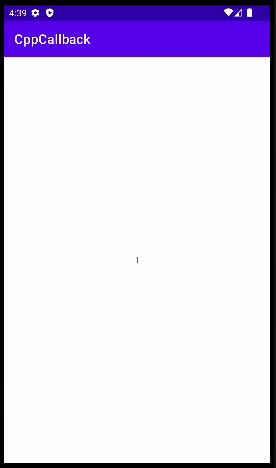

これは [C++ Advent Calendar 2022](https://qiita.com/advent-calendar/2022/cxx) 16日目 の記事です。

はじめまして、[@rin4046](https://twitter.com/rin4046) です。しがない大学生をやっています。

以前、私が所属しているサークルでAndroidアプリを開発したのですが、その際にJava Native Interfaceを介してC++側からKotlinの関数をコールバックする必要がありました。

JNIの関数呼び出しは基本的にコストがかかる操作なのであまり推奨されませんが、C++で実装されたライブラリを使ってAndroidアプリを作成する場合など、どうしても行わなければいけない場面があるかと思います。

今回は、できるだけ気軽かつシンプルに、C++側から任意のタイミングで、Kotlinのラムダ式を呼び出す手法について考えてみました。

## Javaじゃできないの？

Javaのラムダ式は第一級関数ではないので、関数オブジェクトのシグネチャがバイトコード内に埋め込まれていないみたいです(もし認識が間違っていたらすみません)。

Kotlinの場合、第一級関数を扱うことができるため、バイトコード内に引数、戻り値の方が定まったinvokeメソッドを持つ関数オブジェクトが生えています。それのシグネチャをリフレクションで取得するため、Kotlinのみで適用できる方法となっています。

## Kotlin側の実装

### NativeBridge.kt

C++側との橋渡しを行うシングルトンクラス “NativeBridge” を用意します。

registerCallback() が呼ばれた際に、Function\<Unit\> 型の関数オブジェクトからinvokeメソッドのシグネチャを、Javaのリフレクションを用いて動的に取得します。その後、registerCallbackImpl() を用いて、取得したシグネチャと関数オブジェクトをC++側に渡します。

getSignature() はJNI形式のシグネチャを再帰的に取得するための関数です。(参照: [https://docs.oracle.com/javase/jp/1.5.0/guide/jni/spec/types.html](https://docs.oracle.com/javase/jp/1.5.0/guide/jni/spec/types.html))

startThread() はC++側のスレッドを開始するための関数です。今回、あくまで例示のためのコードなので、スレッドの停止処理は用意していません。

```kotlin
package me.rinrin.cppcallback

import java.lang.reflect.Modifier

object NativeBridge {
    fun registerCallback(name: String, callback: Function<Unit>) {
        val invokeMethod =
            callback.javaClass.declaredMethods.find { it.name == "invoke" && (it.modifiers and Modifier.FINAL) != 0 }
                ?: return
        val invokeMethodParams = invokeMethod.parameterTypes ?: return
        val signature = "(${invokeMethodParams.joinToString("") { getSignature(it) }})V"

        registerCallbackImpl(name, callback, signature)
    }

    private fun getSignature(param: Class<*>): String {
        if (param.isArray) {
            return "[${getSignature(param.componentType)}"
        }

        return when (param) {
            Boolean::class.java -> "Z"
            Byte::class.java -> "B"
            Char::class.java -> "C"
            Short::class.java -> "S"
            Int::class.java -> "I"
            Long::class.java -> "J"
            Float::class.java -> "F"
            Double::class.java -> "D"
            else -> "L${param.typeName.replace(".", "/")};"
        }
    }

    external fun startThread()
    private external fun registerCallbackImpl(
        name: String, callback: Function<Unit>, signature: String
    )

    init {
        System.loadLibrary("cppcallback")
    }
}
```

### MainActivity.kt

AndroidのMainActivityクラスでは、startThread() を呼び出すことで、C++側のスレッドをスタートさせ、registerCallback() で関数オブジェクトをC++側に渡しています。この時、第一引数に指定した文字列を用いてC++側からコールバック関数を識別します。

```kotlin
package me.rinrin.cppcallback

import androidx.appcompat.app.AppCompatActivity
import android.os.Bundle
import me.rinrin.cppcallback.databinding.ActivityMainBinding

class MainActivity : AppCompatActivity() {
    private lateinit var binding: ActivityMainBinding

    override fun onCreate(savedInstanceState: Bundle?) {
        super.onCreate(savedInstanceState)

        binding = ActivityMainBinding.inflate(layoutInflater)
        setContentView(binding.root)

        NativeBridge.startThread()

        NativeBridge.registerCallback("callback") { num: Int ->
            runOnUiThread {
                binding.sampleText.text = num.toString()
            }
        }
    }
}
```

## C++側の実装

### native_bridge.hpp

std::unordered_map に、先ほどKotlin側のregisterCallbackImpl() で指定した文字列をキーとしてコールバック関数を管理します。

関数オブジェクトは NewGlobalRef() で寿命を延長するため、メモリリークを起こさないために、同名のコールバック関数が登録されていたらグローバル参照を削除しています(あまり良くない方法かも)。

register_callback() でコールバック関数を登録した後は、invoke() でKotlin側のラムダ式をC++側から呼び出せます。この際、可変長引数テンプレートを用いることで、柔軟な呼び出しが可能になっています。

from_jstring() と to_jstring() は、std::stringとJNIのjstringを相互変換するためのユーティリティ関数です。

```cpp
#pragma once

#include <string>
#include <unordered_map>

#include <jni.h>

class NativeBridge {
  struct Callback {
    jobject function;
    jmethodID method_id;
  };

  std::unordered_map<std::string, Callback> callbacks_;

public:
  void register_callback(JNIEnv *env, jstring name, jobject callback, jstring signature) {
    jmethodID method_id =
        env->GetMethodID(env->GetObjectClass(callback), "invoke", NativeBridge::from_jstring(env, signature).data());

    std::string name_ = NativeBridge::from_jstring(env, name);

    // コールバック間数オブジェクトが既に存在したら解放
    auto itr = callbacks_.find(name_);
    if (itr != callbacks_.end()) {
      env->DeleteGlobalRef(itr->second.function);
      callbacks_.erase(itr);
    }

    callbacks_[name_] = {env->NewGlobalRef(callback), method_id};
  }

  template <class... Args> void invoke(JNIEnv *env, const std::string &name, Args... args) {
    auto itr = callbacks_.find(name);
    if (itr != callbacks_.end()) {
      env->CallVoidMethod(itr->second.function, itr->second.method_id, args...);
    }
  }

  static inline std::string from_jstring(JNIEnv *env, jstring s) {
    const char *s_ = env->GetStringUTFChars(s, nullptr);
    std::string res{s_};
    env->ReleaseStringUTFChars(s, s_);
    return res;
  }

  static inline jstring to_jstring(JNIEnv *env, const std::string &s) {
    return env->NewStringUTF(s.data());
  }
};
```

### native-lib.cpp

NativeBridgeクラスへのアクセスは、register_callbackする際と、invokeする際とで衝突する可能性があるため、mutexで排他制御します。

startThread()がKotlin側から呼ばれると、std::threadがスタートし、1秒ごとにKotlin側にcountの値を返します。

```cpp
#include <chrono>
#include <mutex>
#include <thread>

#include <jni.h>

#include "native_bridge.hpp"

std::mutex mtx;
NativeBridge native_bridge; // 排他制御必須

extern "C" JNIEXPORT void JNICALL Java_me_rinrin_cppcallback_NativeBridge_startThread(JNIEnv *env, jobject) {
  JavaVM *vm;
  env->GetJavaVM(&vm);

  std::thread{[vm] {
    JNIEnv *env;
    vm->AttachCurrentThread(&env, nullptr);

    int count = 0;

    while (true) {
      {
        std::lock_guard lock{mtx};
        native_bridge.invoke(env, "callback", count++);
      }
      std::this_thread::sleep_for(std::chrono::milliseconds{1000});
    }
  }}.detach();
}

extern "C" JNIEXPORT void JNICALL Java_me_rinrin_cppcallback_NativeBridge_registerCallbackImpl(JNIEnv *env, jobject,
                                                                                               jstring name,
                                                                                               jobject callback,
                                                                                               jstring signature) {
  std::lock_guard lock{mtx};
  native_bridge.register_callback(env, name, callback, signature);
}
```

## 実行結果



## おわりに

はじめにも述べたように、JNIでの関数呼び出しはそれなりにコストがかかるので、パフォーマンスチューニングする際は色々と考える必要があります。しかし、こういったコールバックの機構を用意しておくと、あまり深く考えずにサクサク開発を進めることができるので、場合によってはおすすめです。

C++のアドベントカレンダーなのに、Kotlin成分多めの記事になってしまいましたが、C++での排他制御やマルチスレッディング、テンプレートなどそれなりにモダンなC++の要素を取り入れられたのではないかと自分では思っています。

拙い文章ですが、誰かの役に立てば幸いです。
