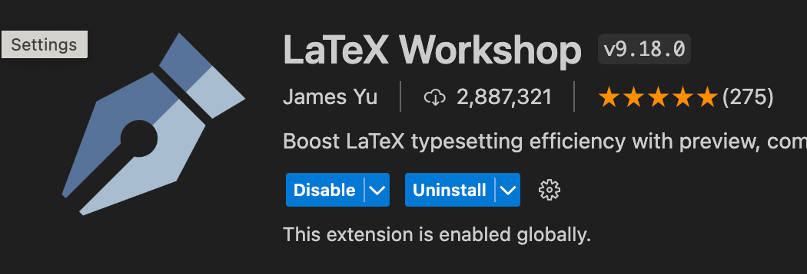

これ以上面倒なことは(今のところは)しないようにしている

## 準備

```sh
brew install --cask mactex-no-gui
```

VSCodeに拡張機能インストール



## settings.json

```json
{
  "[latex]": {
    "editor.wordWrap": "on",
    "editor.formatOnSave": false
  },
  "latex-workshop.latex.outDir": "%DIR%/out",
  "latex-workshop.latex.recipes": [
    {
      "name": "latexmk",
      "tools": ["latexmk"]
    }
  ],
  "latex-workshop.latex.tools": [
    {
      "name": "latexmk",
      "command": "latexmk",
      "args": ["-synctex=1", "-outdir=%OUTDIR%", "%DOC%"]
    }
  ]
}
```

## latexmkrc

```perl
$lualatex = 'lualatex -interaction=nonstopmode %O %S';
$pdf_mode = 4;
```
