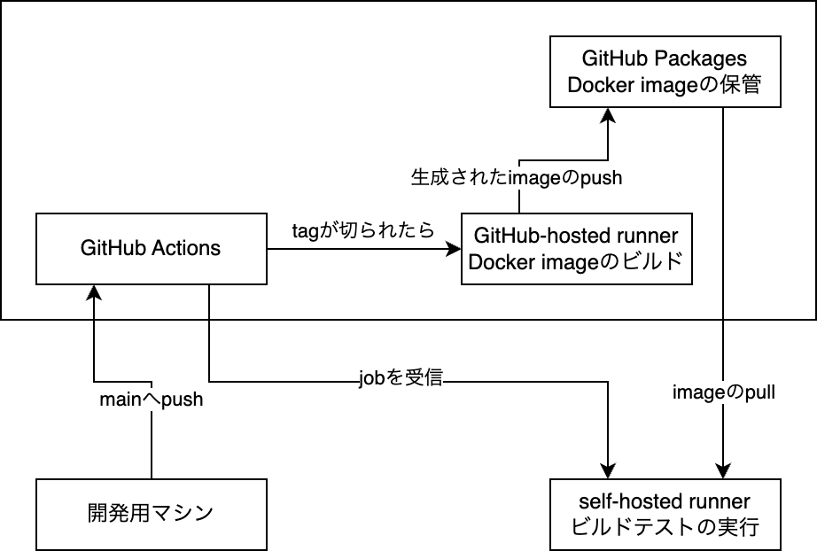

この記事は、[学ロボ Advent Calendar 2023](https://adventar.org/calendars/8926) 12 日目の記事です。

りｎです。田舎の大学のロボコン部に 3 年間所属していました。引退したはずなのですが、部内インフラを色々担当していたために、未だに引き継ぎのようなものに追われています、、、

ここのところ時間が足りなくて発狂＆メンタル崩壊したので、今まで Twitter 等で小出しにしてきた Linux 周りの部内インフラに関する情報をまとめただけの記事になります。もっと詳しく書いて！という箇所があったらリプで教えてください m(\_ \_)m

## Ansible による環境構築の自動化

これは結構やっている人も多いのではないでしょうか。私は dotfiles を管理しているときに [Ansible](https://www.ansible.com/) について知りました。Ansible は主にサーバ向けのプロビジョニングからアプリケーションのデプロイまでを行う構成管理ツールです。通常、サーバを操作する外部の端末に Ansible をインストールし、SSH 等を経由して目的のサーバの構成管理を自動化するという方法で用いられることが多いですが、自分自身の環境構築の自動化のために Ansible を用いることも可能です。

Ansible で構成管理を行うタスクを構成する単位として様々なものがありますが、ここでは弊部で使用しているものに限って紹介します。

- Playbook: \
  Role をまとめる単位、想定する開発環境や特定のマシン向けに用意する(例: Dev, ThinkPad, Raspberry Pi, … みたいな)
- Role: \
  Task をまとめる単位、大まかな環境構築の目的ごとに用意する(例: ROS 2, CUDA, GUI Apps, … みたいな)
- Task: \
  最小のタスクの単位、細分化するほどのタスクを抱えているわけでもないので、1 Role:1 Task で運用している

まとめると、個々人の開発に使用するマシン用の Playbook、 CI 用の Playbook、 実機に載せるマシン用の Playbook を、複数の Roles の中から選んで作っている感じです。

あとはこんな感じで Playbook を実行すれば、ラーメン食いに行ってる間に環境構築が終わります。

```bash
ansible-playbook --ask-become-pass ansible/dev.yml
```

環境差異をなくす目的にも有用なので、使ったことのない方はぜひ。

## GitHub Actions によるビルドテスト

弊部も例に漏れず ROS 2 を採用しているわけなのですが、ROS 2 って依存関係の記載漏れだったり、妙な CMakeLists.txt を書いてしまうことによって発生する再現性のないビルドエラーとかってよくあるじゃないですか(弊部だけ？)それを少しでも減らすために、GitHub Actions によるビルドテストをロボットの workspace に対して行っています。これにより、main ブランチにコードが push されるたびに colcon build が走り、ビルドが成功するかどうかを検証できます。

これの何が嬉しいかというと、例えば実機に載せるマシンを変更するときなどの環境構築をやり直す際に、少なくともビルドが通ることは保証できるという点です。少なくともビルドが通るだけではあるのですが、ROS 2 の workspace では人的ミス(前に述べたようなやつ)によるビルドエラーが頻発します。なので、これだけでも結構ロボットが確実に動作することに貢献できている気がします。

弊部の GitHub Actions によるビルドテストの運用構成は、



みたいな感じです。通常 private リポジトリに対する GitHub Actions の実行は無料プランだと月 2000 分までしか実行できないのですが、[self-hosted runner](https://docs.github.com/ja/actions/hosting-your-own-runners/managing-self-hosted-runners/about-self-hosted-runners)(部室に用意した物理マシン)で GitHub Actions から受信した job を実行することで制限を回避しています。また、ビルドテストにかかる時間を削減するために、部員が用いる開発マシンと同等の Ansible Playbook から Docker image をビルドし、それを用いてビルドテストを実行しています。

## 部内 APT, rosdep リポジトリによるバイナリ配布

ROS 2 workspace を運用するにあたって、rosdep コマンドは普段使用していますでしょうか。使っていない方はぜひこちらの記事をご覧ください。

https://qiita.com/strv/items/ccd89c55957bd8dfada0

と、package.xml から依存関係を自動で解決できるツールとしてとても便利な rosdep ですが、ビルド済みバイナリが提供されていないような野良パッケージも含めて全部これで管理したくないですか？また、そのビルドにかかる時間を削減したくないですか？

そのために、弊部ではビルド済みバイナリ配布と、それの依存関係解決を自動化するための部内 APT、 rosdep リポジトリサーバを GitHub Pages を用いてホストしています。APT リポジトリサーバの構築に関しては、iOS 向け Tweak を Cydia 向けに配布していた時期に学んだ(よくない！)ので、あまりハマる点はありませんでしたが、独自の rosdep リポジトリの運用は初めてだったので色々調べました。

まず、APT リポジトリの作成は以下の Debian Wiki の記事を読めば確実です。記事に出てくる reprepro というツールを用いるのが簡単かつ確実だと思います。

https://wiki.debian.org/DebianRepository/SetupWithReprepro

次に、rosdep リポジトリの構成について説明します。これは、YAML ファイル一つ用意すれば済むみたいです。フォーマットは

```yaml
package.xmlで指定するパッケージ名:
  ubuntu: [APT で指定するパッケージ名]
```

のように書くことで 2 つの対応関係を示すことができ、rosdep install が正常に動作するようになります。このようなファイルを/etc/ros/rosdep/sources.list.d 以下に配置して rosdep update することでリポジトリを追加できます。

以上の reprepro による APT リポジトリ生成、rosdep 向け YAML の自動生成を GitHub Actions に任せることで部内 APT リポジトリサーバの管理を容易にしています。以下は実際に運用しているものです。

https://github.com/tutrobo/tutrobo-ros-apt

ちょっと雑な部分があるので今後修正したいとは思っています。

## おわりに

この記事で、少しでも ROS 2 のための Linux の運用とビルドに悩まされる人を減らせれば幸いです。
