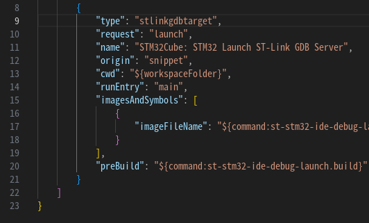

# はじめに

本記事では、STMicroelectronicsが提供するVSCode向け拡張機能「STM32Cube for Visual Studio Code Core」とそれに依存する拡張機能群を用いて、CubeIDEを使用しないSTM32開発環境を構築する手順を掲載しています。

LinuxおよびWindowsで動作確認しています。macOSについては未検証です。  

内容は2025年5月18日時点の情報に基づいています。

# 旧拡張機能の問題点

2023年に公開された「STM32Cube for Visual Studio Code」(以下、旧拡張機能)には、以下のような問題がありました。

- すでに非推奨となっている別の拡張機能に依存している
- STM32CubeCLTへの依存に依存している
  - プロジェクトごとに各種ツールチェインのバージョンを固定できない
    - gcc, gdb, cmake, ...
  - PATH環境変数が汚染されることにより、`cmake` や `ninja` などのパスが上書きされてしまう

特に、STM32CubeCLTの「行儀の悪さ」は非常に厄介なものでした。

# 新拡張機能による改善点

2025年5月、STMicroelectronicsが新たに公開した「STM32Cube for Visual Studio Code Core」(以下、新拡張機能)とそれに依存した拡張機能群によるエコシステムにより、以下のような改善がなされました。

- CubeCLTが不要に
- プロジェクト単位での各種ツールチェインのバージョン固定が可能に

これにより、クリーンでモダンな、CubeIDEの代替として使うのに十分な開発環境の構築が可能になりました。


# 1. 事前準備 (Linux環境の場合)

## 1.1 STLink用のudevルールの追加

STLinkにroot権限なしでアクセスするためには、udevルールの追加が必要です。

以下のリポジトリをcloneし、`*.udev` ファイルを `/etc/udev/rules.d/` ディレクトリに全てコピーしてください。

https://github.com/eyr1n/stlink-udev-rules

## 1.2 libncurses5のインストール

新拡張機能に含まれる `arm-none-eabi-gdb` は、libncurses5に依存しています。本記事ではUbuntu 22.04, 24.04におけるlibncurses5の導入方法について解説します。そのほかのディストリビューションについては、がんばってください。

### Ubuntu 22.04の場合

```bash
sudo apt install libncurses5
```

### Ubuntu 24.04の場合

libncurses5は公式リポジトリから削除されているため、Ubuntu 22.04向けのパッケージを手動でダウンロードし、以下のコマンドでインストールします。

- https://packages.ubuntu.com/jammy/libtinfo5  
- https://packages.ubuntu.com/jammy/libncurses5

```bash
sudo dpkg -i libtinfo5_*.deb libncurses5_*.deb
```

# 2. 必要なソフトウェアのインストール

## 2.1 STM32CubeMXのインストール

STM32CubeMXは、STM32 HAL(or LL) Driverに基づくコード生成ツールです。以下のURLから、使用しているOSに対応するインストーラをダウンロードしてください。

https://www.st.com/ja/development-tools/stm32cubemx.html

# 3. VSCode拡張機能のインストール

## 3.1 STM32関連拡張機能

以下の2つの拡張機能をインストールしてください。

- `STMicroelectronics.stm32cube-ide-bundles-manager`
  - gcc, gdb, cmakeなどソフトウェアバンドルを管理するための拡張機能
- `STMicroelectronics.stm32cube-ide-debug-stlink-gdbserver`
  - VSCodeからSTLinkを使用したデバッグを可能にする拡張機能

これらを導入することで、必要なツールチェインとその他必要な拡張機能も自動的に導入されます。


## 3.2 C/C++拡張機能

(入っていない人はおそらくいないと思いますが)Microsoftが提供する「C/C++」拡張機能もインストールしておくことをおすすめします。これによりコード補完などの機能が有効になります。


# 4. プロジェクトの生成と初期設定

## 4.1 STM32CubeMXでのプロジェクト生成

1. CubeMXを起動し、使用するMCUまたはBoardを選択します
2. 必要な設定を行い、「Project Manager」->「Project」->「Project Settings」->「Toolchain / IDE」を「CMake」に設定します
3. 「GENERATE CODE」ボタンを押してプロジェクトを生成します


## 4.2 VSCodeでプロジェクトを開く

VSCodeで生成されたプロジェクトフォルダを開くと、画面右下に画像のようなダイアログが表示されますので、「Yes」を選択してください。


万一このダイアログを閉じてしまった場合は、「STM32Cube」パネルから「Setup STM32 project(s)」を選び、対象の「Board / Device」を選択して右下の「Save and close」を押せば同じ結果が得られます。

  


## 4.3 初回ビルドの実行

VSCode左下の「ビルド」ボタンを押して、CMakeによる初回ビルドを実行します。これにより実行ファイルが生成されます。


# 5. デバッグ設定の追加

`.vscode/launch.json` にデバッグ構成を記述します。

「実行とデバッグ」パネルから `launch.json` を作成し、「STM32Cube: STLink GDB Server」を選択します。

  


以下の項目を `configurations` 内に追記することで、デバッグ実行時にビルドも同時に行われるようになります。

```json
"preBuild": "${command:st-stm32-ide-debug-launch.build}"
```



この設定により、常に最新のビルド結果でデバッグを開始できるようになります。

# 6. 動作確認

`F5` キーを押してデバッグを実行し、STLink経由でターゲットデバイスに書き込み・接続できることを確認してください。デバッガが正常に起動し、ブレークポイントで停止すれば正常に動作していると思われます。

# おわりに

VSCodeと新拡張機能を使用することで、CubeIDEに依存せずに、クリーンかつモダンなSTM32開発環境を構築することができました。CMakeによるプロジェクト構成のため、外部ライブラリの作成や導入も非常に楽になるかと思います。

今後、追加で判明したことなどあれば更新していくかも。
