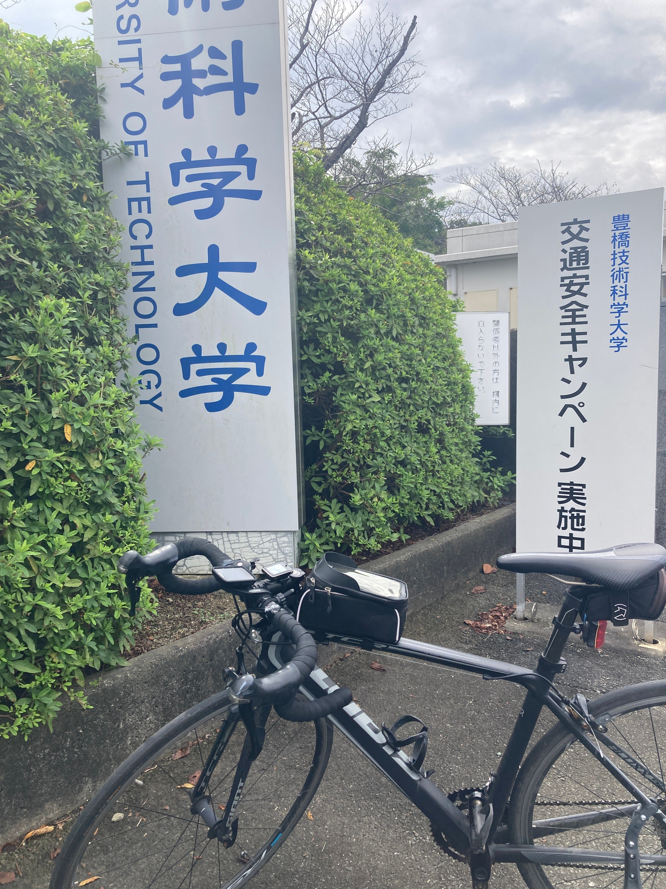

テスト勉強したくないので夏の思い出をまとめることにした．

## 1日目

### 出発

去年の9月22日の午後1時(おそい)，律儀に大学正門から出発．  
この時すでに疲れていたので，岡崎あたりで諦めて帰ろうかなとか思いながら走り始めた．

<figure>

</figure>

### 豊川〜岡崎〜名古屋

豊川→岡崎の間の山を越えてだいぶ疲れてしまったので，道の駅で休憩．この時午後3時．

<figure>

</figure>

その後も割とダラダラと走り続けて午後5時手前でやっとこさ名古屋市に．  
でも名古屋市はだいぶデカいので，抜けるのにかなり時間がかかった．

<figure>

</figure>

### 名古屋〜稲沢〜垂井

名古屋あたりでロードバイクのテールライトが壊れていることに気づいた(メンテ不足)ので，あさひに立ち寄り新しいのを購入．

この後稲沢の丸亀で夕飯食べながらダラダラ携帯を眺めて，「もう帰ろうかな〜」とか考えてた．ちなみに休憩しすぎてもう8時なので帰るにもしんどい．

<figure>

</figure>

午後11時過ぎ，やっとの思いで岐阜県垂井町にたどり着く．  
ここから先は関ヶ原越えが待ち構えているが，深夜に越えるのは流石に危ないし怖いので．そこら辺にあった快活で夜を明かした(受付のクソデカチャイムが店内中に響き渡る，遮音性もクソもない空間だったのであんまり寝られず)．

<figure>

</figure>

### 諸々

- 距離: 122.59km
    
- 獲得標高: 479m
    
- 移動時間: 6:36:22
    
- 平均速度: 18.6km/h
    

## 2日目

### 垂井〜関ヶ原〜米原

0時就寝5時半起床．もうおじいちゃんなので，筋肉痛は2日後にお預けらしい．近くのコンビニでカロリーメイトとかおにぎりとか蓄え，疲労感を紛らわせながら登り始める．  
関ヶ原越えについては計画時から「大したことなさそう」だと思ってたし，実際大したことなかった．適当にペダルをクルクルしながら滋賀県に突入．

<figure>

</figure>

琵琶湖が見えてきた．ビワイチなるサイクリングコースがあるらしいことを聞いていたので，それに沿うようにして進んでみることにした．

<figure>

</figure>

流石に景色が綺麗だ．でも同じような景色が延々と続くのでかなり飽きる．

<figure>

</figure>

### 米原〜大津

もう飽きた，つまらん，となりながら延々と琵琶湖の周りを走る．琵琶湖の周りには注ぎ込む川や流れ出る川がたくさんあるので，それを越えるたびに橋を越えることになり，意外と平坦じゃない．  
これに若干萎えながらも琵琶湖大橋までたどり着く．

<figure>

</figure>

琵琶湖大橋を渡って湖南の大津に入ってすぐのところにいい感じの道の駅があった．ここら辺で昼ごはんをということで午前11時，肉そばを食べた．

<figure>

</figure>

### 大津→京都

大津に入ってからは若干雰囲気が変わった．ロードサイド店が立ち並ぶ，豊橋っぽい風景が広がっていて，道が平たい，走りやすい．車も自転車もそれなりにいるので孤独が紛れた．

だいぶ南に下ってついに比叡山に差し掛かる．  
京都のEmileさんに教えてもらった山中越を行くと覚悟を決め，急勾配を登る．でも流石に斜度10%越えは心折れるって…  
一度斜面でペダルから足を下ろしてしまったがために復帰に手こずったが，なんとかてっぺんまで登った．でもこの先の下りもめちゃくちゃ怖い．車通りも多い中めちゃくちゃゆっくり下った(本当にごめんなさい)．

<figure>

</figure>

午後1時，だんだんと勾配が緩やかになってきて，家やデカめの建物が見えてきた．  
これは京都大学の施設らしい．実物を初めて見たのでちょっと感動．

<figure>

</figure>

そんなこんなで技科大から224kmかけて京都市街まで辿り着いた．ここから先は立命館方面にある友達の家に泊まりに行ったのでぼかしておく．

### 諸々

- 距離: 102.08km
    
- 獲得標高: 695m
    
- 移動時間: 5:25:40
    
- 平均速度: 18.8km/h
